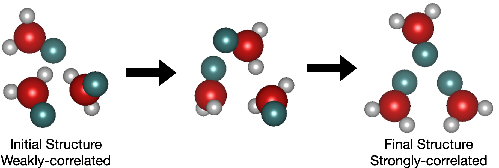

# Rigid Flow Matching with Inertial Frames for Molecular Assembly

Authors: Hongyu Guo, Yoshua Bengio, Shengchao Liu

[[Paper](https://openreview.net/forum?id=jckKNzYYA6)] [[Datasets on HuggingFace](https://huggingface.co/datasets/chao1224/CrystalFlow)] [[Checkpoints on HuggingFace](https://huggingface.co/chao1224/AssembleFlow)]

<p align="center">
   
</p>


## 1. Environment

### Conda

Setup the anaconda
 ```bash
wget https://repo.continuum.io/archive/Anaconda3-2019.10-Linux-x86_64.sh
bash Anaconda3-2019.10-Linux-x86_64.sh -b
export PATH=$PWD/anaconda3/bin:$PATH
 ```

### Packages
Start with some basic packages.
```bash
conda create -n AssembleFlow python=3.9
conda activate AssembleFlow
conda install -y numpy networkx scikit-learn
conda install -y -c conda-forge rdkit
conda install -y pytorch==2.2 pytorch-cuda=12.1 -c pytorch -c nvidia
conda install -y -c pyg -c conda-forge pyg=2.5
conda install -y -c pyg pytorch-scatter
conda install -y -c pyg pytorch-sparse
conda install -y -c pyg pytorch-cluster
pip install pymatgen
pip install -e .
```

## 2. Dataset: COD-Cluster17

COD-Cluster17 is obtained from the [CrystalFlow project](https://github.com/chao1224/CrystalFlow), and it is available at this [HuggingFace link](https://huggingface.co/datasets/chao1224/CrystalFlow).

## 3. Scripts

A demo python script is:
```
python main.py \
--dataset=COD_5000 --epochs=20 --seed=0 \
--model=AssembleFlow_Atom --verbose
```

If we are using the pretrained checkpoints, then we can specify:
```
...... --output_model_dir=pretrained_path --load_pretrained=1
```

Please check the `scripts` folder for the detailed hyperparameters.

## 4. Checkpoints

We provide the checkpoints at this [HuggingFace link](https://huggingface.co/chao1224/AssembleFlow). Notice that some hyperparameters will give NaN results, so we just skip them.

## Cite Us

Feel free to cite this work if you find it useful to you!

```
@inproceedings{
    guo2025assembleflow,
    title={AssembleFlow: Rigid Flow Matching with Inertial Frames for Molecular Assembly},
    author={Hongyu Guo and Yoshua Bengio and Shengchao Liu},
    booktitle={The Thirteenth International Conference on Learning Representations},
    year={2025},
    url={https://openreview.net/forum?id=jckKNzYYA6}
}
```
